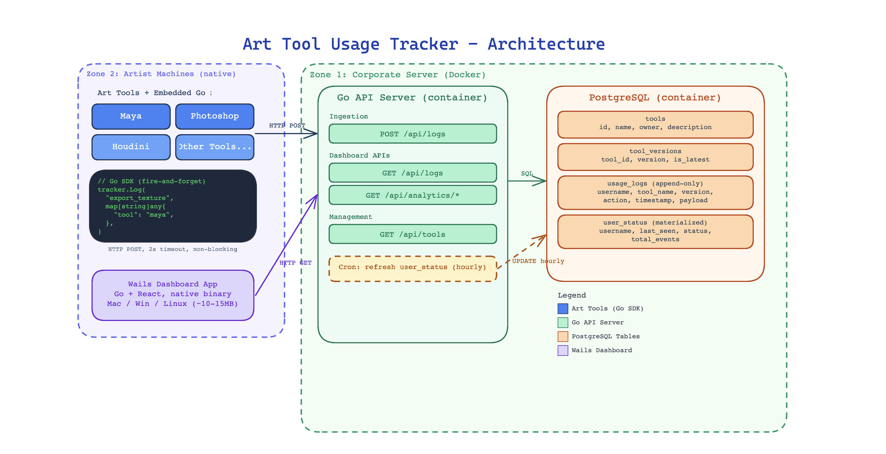

# Art Tool Usage Tracker

Internal system for tracking adoption and usage of marketing art tools (Maya, Photoshop, etc.). Provides dashboards for tool popularity, version adoption, and user churn detection.

## Architecture

For the full architecture document, see [architecture.md](architecture.md).
